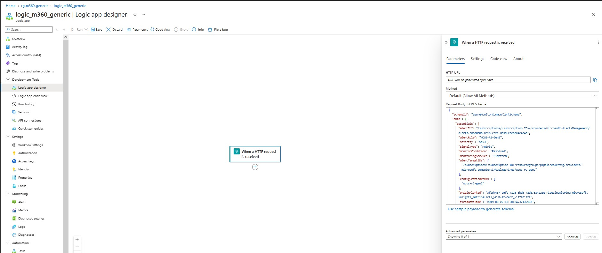
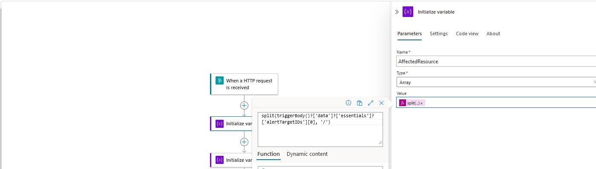
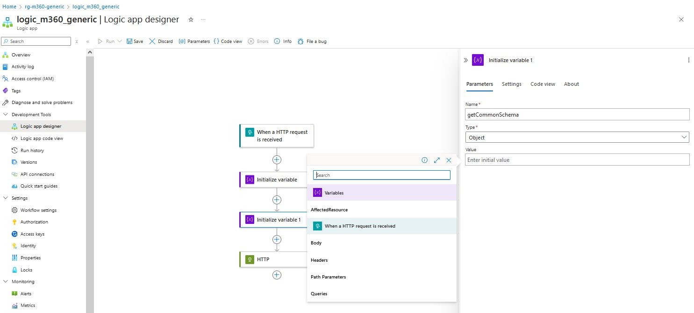
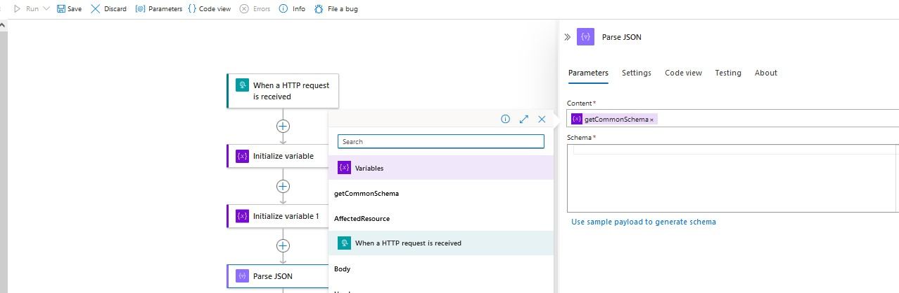
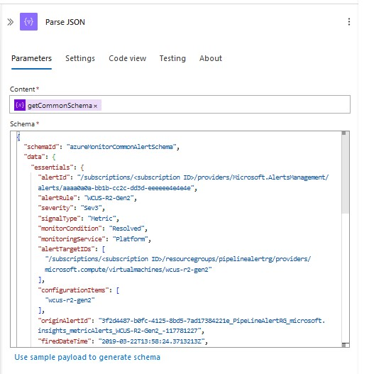
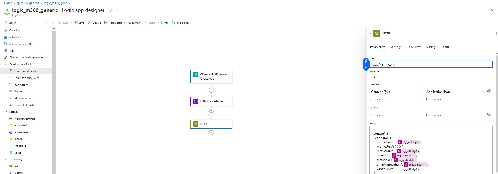
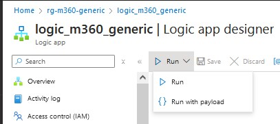
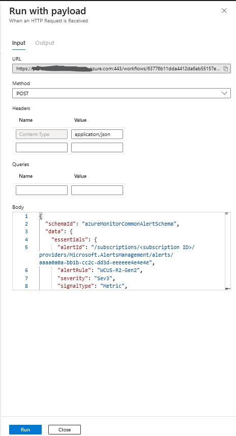
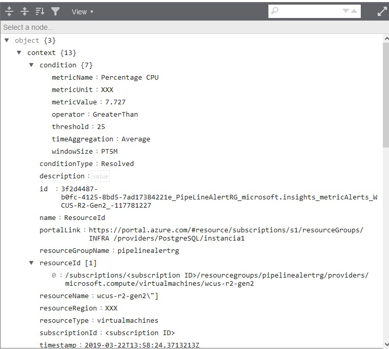
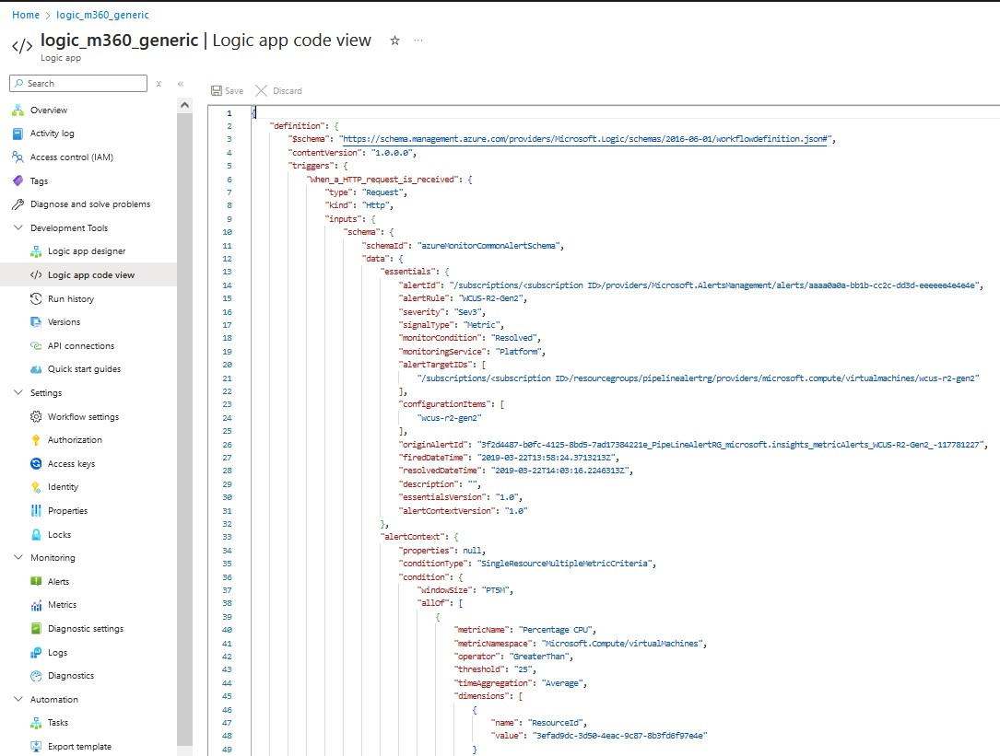

# Introducción
Estos son los pasos para crear una logic app con terraform que interactue con una herramienta de ITSM como por ejemplo M360.

## Crear la logic app
El primer paso es crear una logic app.
Dejo el código para una de tipo pay as you go

## Creo en el portal el código que tendrá la logic app

### En logic app designer creo un trigger de tipo When a HTTP request is received
En Request Body JSON Schema pongo el esquema del json de la alerta que vamos a recivir. En este caso cojo [Azure monitor common alert schema](https://learn.microsoft.com/en-us/azure/azure-monitor/alerts/alerts-common-schema) como se ve en la imagen  
<br />
 

### Inicializo las variables. (Metodo uno)
Has 2 formas de inicializar las variables. Esta forma consiste en añadir un paso para inicializar por cada variable como vamos necesitar. En este caso solo inicializaré  par de ellas.

#### Añado un paso para inicializar una variable. 

El código se obtiene de json que vamos a recibir. En este caso quiereo que mi variable sea el nombre del recurso que en el [Azure monitor common alert schema](https://learn.microsoft.com/en-us/azure/azure-monitor/alerts/alerts-common-schema) que está en en data->essentials->alertTargetIDs

Como solo quiero el nombre del recurso, con la función split separo por '/' y me quedo con el último elmento

Por lo que la configuración de este paso es:
- Name: AffectedResource
- Type: Array
- Value: @{split(triggerBody()?['data']?['essentials']?['alertTargetIDs'] [0], '/')}

Como se ve en la imagen 

### Añado otro paso como ejemplo
En este caso voy a capturar el body de la alerta. Sigo los pasos anteriores con los datos
- Name: body
- Type: Object
- Value: body
  
Como se ve en la imagen   


### Inicializo las variables. (Metodo dos)
Añado un paso para parsear el json y coger las variables

Añado el paso Parse JSON
En content en el trueno seleciono getCommonSchema   

y en schema pongo el [Azure monitor common alert schema](https://learn.microsoft.com/en-us/azure/azure-monitor/alerts/alerts-common-schema) como se ve en   

### Añado una acción de HTTP
En este paso vamos a mandar la información a la herramienta de ITSM. Para ello necesitamos saber en que formato espera esta herramienta la información

Rellenamos
- Uri: la dirección de escucha de la herramienta de ITSM. En nuesto caso vamos a enviar un json
- Method: Post
- Headers: Content-Type = Application/json
- Body: 
```
{
  "context": {
    "condition": {
      "metricName": @{triggerBody()?['data']?['alertContext']?['condition']?['allOf']?[0]?['metricName']},
      "metricUnit": "XXX",
      "metricValue": @{triggerBody()?['data']?['alertContext']?['condition']?['allOf']?[0]?['metricValue']},
      "operator": @{triggerBody()?['data']?['alertContext']?['condition']?['allOf']?[0]?['operator']},
      "threshold": @{triggerBody()?['data']?['alertContext']?['condition']?['allOf']?[0]?['threshold']},
      "timeAggregation": @{triggerBody()?['data']?['alertContext']?['condition']?['allOf']?[0]?['timeAggregation']},
      "windowSize": @{triggerBody()?['data']?['alertContext']?['condition']?['windowSize']}
    },
    "conditionType": @{body('Parse_JSON')?['data']?['essentials']?['monitorCondition']},
    "description": @{triggerBody()?['data']?['essentials']?['description']},
    "id": @{triggerBody()?['data']?['essentials']?['originAlertId']},
    "name": @{triggerBody()?['data']?['alertContext']?['condition']?['allOf']?[0]?['dimensions']?[0]?['name']},
    "portalLink": "https://portal.azure.com/#resource/subscriptions/s1/resourceGroups/INFRA /providers/PostgreSQL/instancia1",
    "resourceGroupName": @{split(string(triggerBody()?['data']?['essentials']?['alertTargetIDs']),'/')[4]},
    "resourceId": @{body('Parse_JSON')?['data']?['essentials']?['alertTargetIDs']},
    "resourceName": @{split(string(triggerBody()?['data']?['essentials']?['alertTargetIDs']),'/')[8]},
    "resourceRegion": "XXX",
    "resourceType": @{split(string(triggerBody()?['data']?['essentials']?['alertTargetIDs']),'/')[7]},
    "subscriptionId": @{split(string(triggerBody()?['data']?['essentials']?['alertTargetIDs']),'/')[2]},
    "timestamp": @{triggerBody()?['data']?['essentials']?['firedDateTime']}
  },
  "properties": {
    "data": @{body('Parse_JSON')?['data']},
    "key2": "value2"
  },
  "status": @{body('Parse_JSON')?['data']?['essentials']?['monitorCondition']}
}
``` 
  
    
Como se ve en la imagen 

## (Opcional) Probamos que todo va bien
Si tenemos un servidor de REST APIs podemos comprobar si estamos recibiendo la información correcta  

Ejecutamos la logic App  
   
 
  
 y añadimos un ejemplo de alerta [commonSchema](https://learn.microsoft.com/en-us/azure/azure-monitor/alerts/alerts-payload-samples)



Utilizo un json formatter para ver el 

## añadir el código de la logic app al terraform
voy a Logic app code view y colo el código de parameters y definition y lo pongo en el código
  
  
  
```  
{
    "$schema": "https://schema.management.azure.com/schemas/2019-04-01/deploymentTemplate.json#",
    "contentVersion": "1.0.0.0",
    "parameters": {
        "logic_app_name": {
            "type": "String"
        },
 
        "location": {
            "defaultValue": "uksouth",
            "type": "String"
        }
     },
    "variables": {
       
    },
    "resources": [
        {
            "type": "Microsoft.Logic/workflows",
            "apiVersion": "2017-07-01",
            "name": "[parameters('logic_app_name')]",
            "location": "[parameters('location')]",
            "properties": {
                "state": "Enabled",
    "definition": {
    },
    "parameters": {
    }
            }
        }
         
    ],
    "outputs": {
     }
}
``` 
  

Añadimos en el bloque de **definition** y **paramaters** lo que tenemos en la logic app quedando
```  
{
    "$schema": "https://schema.management.azure.com/schemas/2019-04-01/deploymentTemplate.json#",
    "contentVersion": "1.0.0.0",
    "parameters": {
        "logic_app_name": {
            "type": "String"
        },
 
        "location": {
            "defaultValue": "uksouth",
            "type": "String"
        }
     },
    "variables": {
       
    },
    "resources": [
        {
            "type": "Microsoft.Logic/workflows",
            "apiVersion": "2017-07-01",
            "name": "[parameters('logic_app_name')]",
            "location": "[parameters('location')]",
            "properties": {
                "state": "Enabled",
    "definition": {
        "$schema": "https://schema.management.azure.com/providers/Microsoft.Logic/schemas/2016-06-01/workflowdefinition.json#",
        "contentVersion": "1.0.0.0",
        "triggers": {
            "When_a_HTTP_request_is_received": {
                "type": "Request",
                "kind": "Http",
                "inputs": {
                    "schema": {
                        "schemaId": "azureMonitorCommonAlertSchema",
                        "data": {
                            "essentials": {
                                "alertId": "/subscriptions/<subscription ID>/providers/Microsoft.AlertsManagement/alerts/aaaa0a0a-bb1b-cc2c-dd3d-eeeeee4e4e4e",
                                "alertRule": "WCUS-R2-Gen2",
                                "severity": "Sev3",
                                "signalType": "Metric",
                                "monitorCondition": "Resolved",
                                "monitoringService": "Platform",
                                "alertTargetIDs": [
                                    "/subscriptions/<subscription ID>/resourcegroups/pipelinealertrg/providers/microsoft.compute/virtualmachines/wcus-r2-gen2"
                                ],
                                "configurationItems": [
                                    "wcus-r2-gen2"
                                ],
                                "originAlertId": "3f2d4487-b0fc-4125-8bd5-7ad17384221e_PipeLineAlertRG_microsoft.insights_metricAlerts_WCUS-R2-Gen2_-117781227",
                                "firedDateTime": "2019-03-22T13:58:24.3713213Z",
                                "resolvedDateTime": "2019-03-22T14:03:16.2246313Z",
                                "description": "",
                                "essentialsVersion": "1.0",
                                "alertContextVersion": "1.0"
                            },
                            "alertContext": {
                                "properties": null,
                                "conditionType": "SingleResourceMultipleMetricCriteria",
                                "condition": {
                                    "windowSize": "PT5M",
                                    "allOf": [
                                        {
                                            "metricName": "Percentage CPU",
                                            "metricNamespace": "Microsoft.Compute/virtualMachines",
                                            "operator": "GreaterThan",
                                            "threshold": "25",
                                            "timeAggregation": "Average",
                                            "dimensions": [
                                                {
                                                    "name": "ResourceId",
                                                    "value": "3efad9dc-3d50-4eac-9c87-8b3fd6f97e4e"
                                                }
                                            ],
                                            "metricValue": 7.727
                                        }
                                    ]
                                }
                            },
                            "customProperties": {
                                "Key1": "Value1",
                                "Key2": "Value2"
                            }
                        }
                    }
                }
            }
        },
        "actions": {
            "Initialize_variable": {
                "runAfter": {},
                "type": "InitializeVariable",
                "inputs": {
                    "variables": [
                        {
                            "name": "AffectedResource",
                            "type": "array",
                            "value": "@split(triggerBody()?['data']?['essentials']?['alertTargetIDs'][0], '/')"
                        }
                    ]
                }
            },
            "HTTP": {
                "runAfter": {
                    "Parse_JSON": [
                        "Succeeded"
                    ]
                },
                "type": "Http",
                "inputs": {
                    "uri": "http://urlQueEscuchaITSM",
                    "method": "POST",
                    "headers": {
                        "Content-Type": "Application/json"
                    },
                    "body": {
                        "context": {
                            "condition": {
                                "metricName": "@triggerBody()?['data']?['alertContext']?['condition']?['allOf']?[0]?['metricName']",
                                "metricUnit": "XXX",
                                "metricValue": "@triggerBody()?['data']?['alertContext']?['condition']?['allOf']?[0]?['metricValue']",
                                "operator": "@triggerBody()?['data']?['alertContext']?['condition']?['allOf']?[0]?['operator']",
                                "threshold": "@triggerBody()?['data']?['alertContext']?['condition']?['allOf']?[0]?['threshold']",
                                "timeAggregation": "@triggerBody()?['data']?['alertContext']?['condition']?['allOf']?[0]?['timeAggregation']",
                                "windowSize": "@triggerBody()?['data']?['alertContext']?['condition']?['windowSize']"
                            },
                            "conditionType": "@body('Parse_JSON')?['data']?['essentials']?['monitorCondition']",
                            "description": "@triggerBody()?['data']?['essentials']?['description']",
                            "id": "@triggerBody()?['data']?['essentials']?['originAlertId']",
                            "name": "@triggerBody()?['data']?['alertContext']?['condition']?['allOf']?[0]?['dimensions']?[0]?['name']",
                            "portalLink": "https://portal.azure.com/#resource/subscriptions/s1/resourceGroups/INFRA /providers/PostgreSQL/instancia1",
                            "resourceGroupName": "@split(string(triggerBody()?['data']?['essentials']?['alertTargetIDs']),'/')[4]",
                            "resourceId": "@body('Parse_JSON')?['data']?['essentials']?['alertTargetIDs']",
                            "resourceName": "@split(string(triggerBody()?['data']?['essentials']?['alertTargetIDs']),'/')[8]",
                            "resourceRegion": "XXX",
                            "resourceType": "@split(string(triggerBody()?['data']?['essentials']?['alertTargetIDs']),'/')[7]",
                            "subscriptionId": "@split(string(triggerBody()?['data']?['essentials']?['alertTargetIDs']),'/')[2]",
                            "timestamp": "@triggerBody()?['data']?['essentials']?['firedDateTime']"
                        },
                        "properties": {
                            "data": "@body('Parse_JSON')?['data']",
                            "key2": "value2"
                        },
                        "status": "@body('Parse_JSON')?['data']?['essentials']?['monitorCondition']"
                    }
                },
                "runtimeConfiguration": {
                    "contentTransfer": {
                        "transferMode": "Chunked"
                    }
                }
            },
            "Initialize_variable_1": {
                "runAfter": {
                    "Initialize_variable": [
                        "Succeeded"
                    ]
                },
                "type": "InitializeVariable",
                "inputs": {
                    "variables": [
                        {
                            "name": "getCommonSchema",
                            "type": "object",
                            "value": "@triggerBody()"
                        }
                    ]
                }
            },
            "Parse_JSON": {
                "runAfter": {
                    "Initialize_variable_1": [
                        "Succeeded"
                    ]
                },
                "type": "ParseJson",
                "inputs": {
                    "content": "@variables('getCommonSchema')",
                    "schema": {
                        "schemaId": "azureMonitorCommonAlertSchema",
                        "data": {
                            "essentials": {
                                "alertId": "/subscriptions/<subscription ID>/providers/Microsoft.AlertsManagement/alerts/aaaa0a0a-bb1b-cc2c-dd3d-eeeeee4e4e4e",
                                "alertRule": "WCUS-R2-Gen2",
                                "severity": "Sev3",
                                "signalType": "Metric",
                                "monitorCondition": "Resolved",
                                "monitoringService": "Platform",
                                "alertTargetIDs": [
                                    "/subscriptions/<subscription ID>/resourcegroups/pipelinealertrg/providers/microsoft.compute/virtualmachines/wcus-r2-gen2"
                                ],
                                "configurationItems": [
                                    "wcus-r2-gen2"
                                ],
                                "originAlertId": "3f2d4487-b0fc-4125-8bd5-7ad17384221e_PipeLineAlertRG_microsoft.insights_metricAlerts_WCUS-R2-Gen2_-117781227",
                                "firedDateTime": "2019-03-22T13:58:24.3713213Z",
                                "resolvedDateTime": "2019-03-22T14:03:16.2246313Z",
                                "description": "",
                                "essentialsVersion": "1.0",
                                "alertContextVersion": "1.0"
                            },
                            "alertContext": {
                                "properties": null,
                                "conditionType": "SingleResourceMultipleMetricCriteria",
                                "condition": {
                                    "windowSize": "PT5M",
                                    "allOf": [
                                        {
                                            "metricName": "Percentage CPU",
                                            "metricNamespace": "Microsoft.Compute/virtualMachines",
                                            "operator": "GreaterThan",
                                            "threshold": "25",
                                            "timeAggregation": "Average",
                                            "dimensions": [
                                                {
                                                    "name": "ResourceId",
                                                    "value": "3efad9dc-3d50-4eac-9c87-8b3fd6f97e4e"
                                                }
                                            ],
                                            "metricValue": 7.727
                                        }
                                    ]
                                }
                            },
                            "customProperties": {
                                "Key1": "Value1",
                                "Key2": "Value2"
                            }
                        }
                    }
                }
            }
        },
        "parameters": {
            "$connections": {
                "type": "Object",
                "defaultValue": {}
            }
        }
    },
    "parameters": {
        "$connections": {
            "value": {}
        }
    }
            }
        }
         
    ],
    "outputs": {
     }
}
``` 
  
y lo guardo como workflow.json
